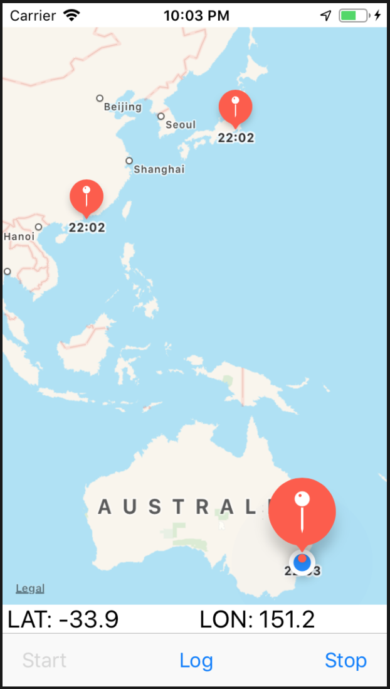
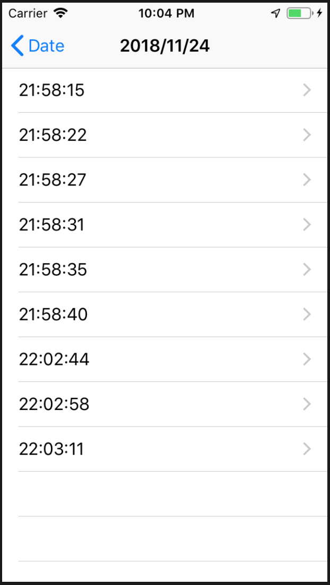
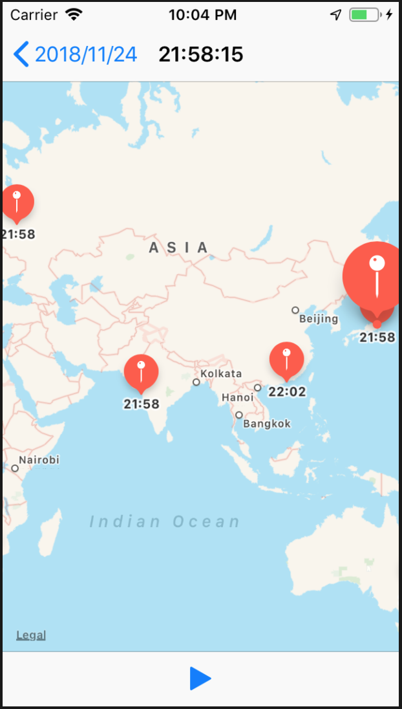

## Track Location

*位置情報の追跡で子どもが一人でお出かけしても安心アプリ*  
*PaaSやSaaSと連携して情報共有することを想定(時間がないので今回は実装しませんが、、、)*

1. 概要

    - 現在位置を取得して地図上に表示する
    - 現在位置を日毎に保存する
    - 保存した現在位置を地図上に静的に表示する
    - 保存した現在位置を地図上に動的に表示する
    - 精度
        1. 更新に関連するユーザのアクティビティ: 歩行者
        2. 距離精度(m): 100m
        3. 更新頻度に関わる移動距離(m): 100m

1. 環境

    - Xcode 10.1
    - Swift 4.2.1
    - Man-hour 5.0h

1. 学び / ポイント

    - マップ機能の使い方 / MapKit
    - 経緯度の取得方法 / CoreLocation

1. イメージ

    |                           Screen1                           |     |                           Screen2                           |     |                           Screen3                           |
    |-------------------------------------------------------------|-----|-------------------------------------------------------------|-----|-------------------------------------------------------------|
    |  | >>> |  | >>> |  |

1. ソースコード

    [GitHub](https://github.com/nsuhara/swift-TrackLocation.git)
